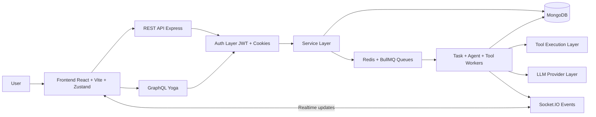
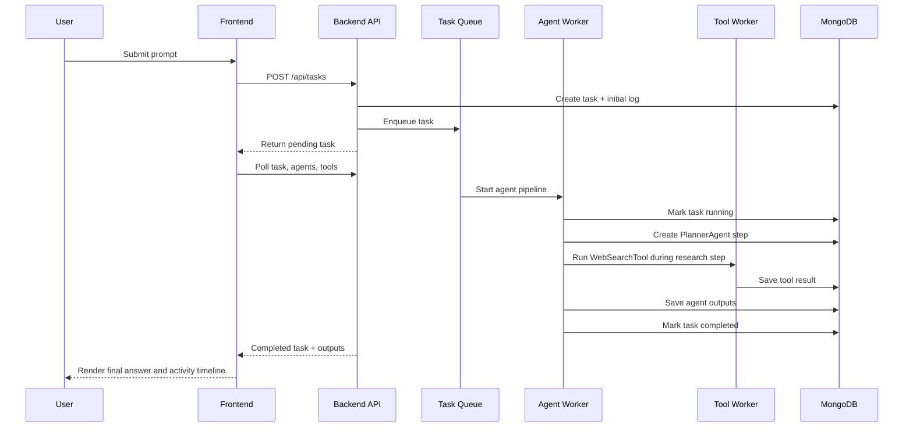

# Wind Monorepo


Wind is a full-stack autonomous agent system with a React frontend and a Node.js backend.

The project is organized into:

1. frontend: user interface and client-side state.
2. backend: auth, task orchestration, agent/tool execution, APIs, queues, and sockets.

---

## 📸 UI Preview

### Dashboard Interface


### Agent Activity Timeline


### Task Execution View


---


## High-Level Feature Set

1. User authentication and session management with access/refresh JWTs.
2. Prompt-driven task creation and lifecycle tracking.
3. Multi-agent execution pipeline:
   PlannerAgent, ResearchAgent, AnalysisAgent, WriterAgent.
4. Tool execution subsystem with persisted results and statuses.
5. Activity visualization in UI with plan/steps/tools timeline.
6. Real-time backend event emission over Socket.IO.
7. GraphQL + REST support in backend.
8. User-specific system settings persisted server-side.
9. Responsive, animated UI experience including route guard loading scenes.
10. File attachment analysis — upload code, CSV, JSON, Markdown, or PDF files and ask AI questions about them.
11. Per-conversation token usage tracking displayed on every assistant message.
12. Gemini API integration (free tier) as the primary LLM provider.

## Repository Layout

1. backend/
2. frontend/

## End-to-End Architecture

1. Frontend sends auth and task requests to backend REST APIs.
2. Backend persists data in MongoDB and optionally queues jobs in Redis/BullMQ.
3. Worker chain executes task -> agent -> tool stages.
4. Backend emits socket events per task room.
5. Frontend polls task, agent, and tool APIs to render current state.
6. Final response is added to chat stream when task completes.

## Architecture Diagram



This diagram shows the main runtime path: the frontend sends requests to the backend, the backend persists data and dispatches work, and workers emit task progress back to the UI.

## Example Workflow

Example: a user asks Wind to research a topic and return a final answer.



Detailed workflow:

1. The user enters a prompt in the frontend chat input.
2. The frontend creates a backend task through `POST /api/tasks`.
3. The backend stores the task in MongoDB with `pending` status.
4. If Redis is enabled, the task is queued; otherwise the backend falls back to inline execution.
5. The agent pipeline runs in order: PlannerAgent, ResearchAgent, AnalysisAgent, WriterAgent.
6. During the research phase, the backend triggers a tool execution such as `WebSearchTool`.
7. Agent outputs and tool outputs are saved as separate records.
8. The frontend keeps polling task detail, agent steps, and tool executions.
9. When the task reaches `completed`, the frontend inserts the final assistant message into the conversation.
10. The activity panel shows the plan, agent steps, and tool execution results for the same task.

## Backend Highlights

1. Express app with layered architecture.
2. GraphQL endpoint at /graphql with auth-aware context.
3. Socket.IO events for task lifecycle updates.
4. Settings API for aiModel/temperature/tool permissions/autonomous mode.
5. Redis cache helpers for faster task list/detail responses.
6. LLM provider fallback chain for resilience.
7. File attachment support — files are stored in MongoDB with `content` hidden by default (`select: false`) and fetched only during task execution.
8. Token usage accumulation across all four agent LLM calls, persisted to the task record.
9. Gemini provider integration with real `usageMetadata` token extraction.

See backend-specific guide in backend/README.md.

## Frontend Highlights

1. React Router with public/protected route guards.
2. Zustand stores for auth/chat/agent/ui state.
3. Typed API utility with auto refresh-and-retry logic.
4. Settings modal integrated with backend settings API.
5. Adaptive sidebar and activity panel responsive behavior.
6. Motion-based loading and interface animations.
7. File attachment UI — paperclip button in chat input, client-side file reading, PDF text extraction via `pdfjs-dist`, attachment preview pill.
8. Token usage badge on every assistant message showing total, prompt, and completion counts.
9. Redesigned chat messages — card layout, full ReactMarkdown rendering with styled headings/lists/code blocks, and aligned user/assistant bubbles.

See frontend-specific guide in frontend/README.md.

## Quick Start (Full Project)

1. Install backend dependencies.

```bash

cd backend
npm install

```

2. Configure backend environment (.env from .env.example) and ensure MongoDB is available.

3. Optional but recommended: start Redis and enable REDIS_ENABLED=true.

4. Start backend.

```bash

npm run dev

```

5. In a second terminal, install frontend dependencies.

```bash

cd ../frontend
npm install

```

6. Set frontend env as needed (VITE_API_BASE_URL should point to backend).

7. Start frontend.

```bash

npm run dev

```

8. Open the app at http://localhost:3000.

## Primary API Surface (Backend)

REST:

1. POST /api/auth/register
2. POST /api/auth/login
3. POST /api/auth/refresh
4. POST /api/tasks
5. GET /api/tasks
6. GET /api/tasks/:id
7. GET /api/agents/tasks/:taskId
8. GET /api/tools/tasks/:taskId
9. GET /api/settings
10. PUT /api/settings

GraphQL:

1. POST /graphql

Health:

1. GET /health

## Realtime Events

1. task_started
2. agent_step
3. tool_executed
4. task_completed
5. task_failed

## Scripts

Backend scripts:

1. npm run dev
2. npm run build
3. npm run start
4. npm run check

Frontend scripts:

1. npm run dev
2. npm run build
3. npm run preview
4. npm run lint

## Additional Notes

1. MongoDB indexes are declared in Mongoose models and synchronized at startup.
2. If Redis is unavailable, task execution still works via inline fallback path.
3. Frontend and backend are loosely coupled through typed API contracts in frontend/src/utils/api.ts.

## File Attachment Feature

Users can attach files to any message and ask the AI questions about the file content.

Supported file types:

| Kind     | Extensions                                                                                                      |
| -------- | --------------------------------------------------------------------------------------------------------------- |
| code     | .js .jsx .ts .tsx .py .java .c .cpp .cs .go .rb .rs .php .swift .kt .scala .sh .sql .html .css .xml .yaml .toml |
| csv      | .csv                                                                                                            |
| json     | .json                                                                                                           |
| markdown | .md .mdx                                                                                                        |
| pdf      | .pdf                                                                                                            |
| text     | .txt                                                                                                            |

Size limits: 2 MB for all types; 10 MB for PDF files.
Content limit: 120,000 characters stored per attachment.

How it works:

1. User clicks the paperclip icon in the chat input and selects a file.
2. The frontend reads the file locally (PDF extraction uses `pdfjs-dist` Web Worker).
3. The file content is sent alongside the prompt in the `POST /api/tasks` body.
4. The backend stores the content in MongoDB with `select: false` so it is never returned in list/detail API calls.
5. During task execution, `findByIdWithAttachment` fetches the content and injects it into the agent prompts.
6. The ResearchAgent skips the WebSearchTool when an attachment is present, focusing entirely on the provided content.

## Token Usage Tracking

Every completed task records token usage across all four agent LLM calls.

- Backend accumulates `promptTokens`, `completionTokens`, and `totalTokens` across PlannerAgent, ResearchAgent, AnalysisAgent, WriterAgent, and the final synthesis call.
- Token counts are read from each provider's native response fields (Gemini `usageMetadata`, OpenAI/OpenRouter `usage`).
- The accumulated totals are saved to the task document in MongoDB.
- Frontend displays a token badge at the bottom of each assistant message: `X,XXX tokens · Y in · Z out`.

## LLM Provider Configuration

The backend uses a fallback chain: Gemini → OpenRouter → OpenAI → local simulation.

To use Gemini (free tier) as the primary provider, set in `backend/.env`:

```env

LLM_PROVIDER=gemini
GEMINI_API_KEY=your_key_here

```

Optional overrides:

```env

GEMINI_BASE_URL=https://generativelanguage.googleapis.com/v1beta
GEMINI_MODEL=gemini-2.0-flash

```
